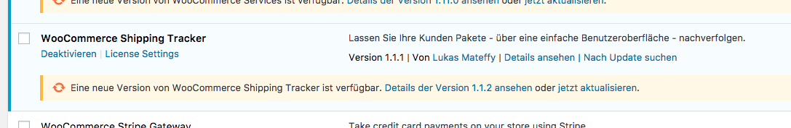

# WPLS – WordPress License Server

> This item [used to be sold on CodeCanyon](https://codecanyon.net/item/wordpress-plugin-update-license-server-automatic-updates-for-your-own-plugins/21464774) 
> but I don't have the time to support it anymore.
> I decided to open-source it instead. See [Documentation](Documentation.pdf) for instructions for setting up WPLS.

## What is WPLS
WordPress License Server enables you to supply automatic updates for the plugins you develop, while only allowing such features if the customer actually owns a license.
You can either create and manage your own licenses or simply verify Envato Purchase Codes using the Envato API.
The Laravel application / PHP script is built for other theme/plugin developers, who want automatic updates and license/Envato purchase code verification for their own plugins. So if you want to implement such features into your plugin, this project is right for you!

## Key Features
- Automatic updates for your premium plugins
- Verify Envato Purchase Codes
- Verify Licenses that you’ve issued yourself
- Detects if the customer is still in support-time window
- Easy PHP integration into your WordPress plugins
- Clean, extendable PSR-4 PHP code
- Built using Laravel
- Easy-to-use admin backend
- Beautiful User Interface

## Usage
Take a look at [documentation](Documentation.pdf) for instructions on setting up WPLS.

The companion client, for verifying codes in your plugins can be found [here](https://github.com/Capevace/wordpress-plugin-updater).
You'll need to implement this in your plugin code to connect it to the server.

_Please note that the server itself is not a WordPress plugin. It is a PHP script, which you have to host on your own server via FTP and SSH._

## Screenshots

## License – MIT
Copyright 2021 Lukas Mateffy

Permission is hereby granted, free of charge, to any person obtaining a copy of this software and associated documentation files (the "Software"), to deal in the Software without restriction, including without limitation the rights to use, copy, modify, merge, publish, distribute, sublicense, and/or sell copies of the Software, and to permit persons to whom the Software is furnished to do so, subject to the following conditions:

The above copyright notice and this permission notice shall be included in all copies or substantial portions of the Software.

THE SOFTWARE IS PROVIDED "AS IS", WITHOUT WARRANTY OF ANY KIND, EXPRESS OR IMPLIED, INCLUDING BUT NOT LIMITED TO THE WARRANTIES OF MERCHANTABILITY, FITNESS FOR A PARTICULAR PURPOSE AND NONINFRINGEMENT. IN NO EVENT SHALL THE AUTHORS OR COPYRIGHT HOLDERS BE LIABLE FOR ANY CLAIM, DAMAGES OR OTHER LIABILITY, WHETHER IN AN ACTION OF CONTRACT, TORT OR OTHERWISE, ARISING FROM, OUT OF OR IN CONNECTION WITH THE SOFTWARE OR THE USE OR OTHER DEALINGS IN THE SOFTWARE.
